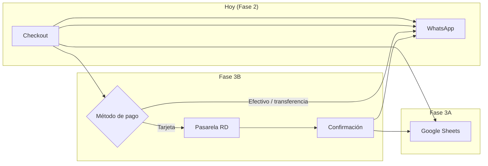
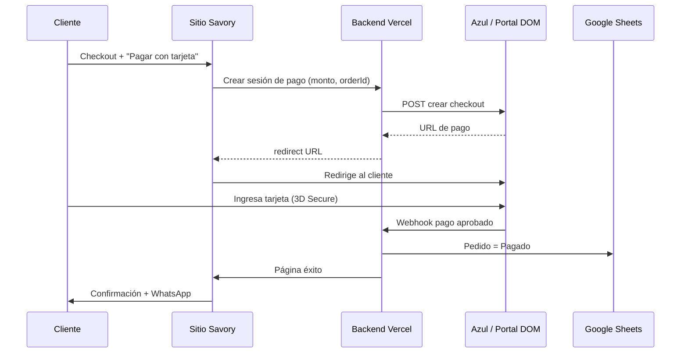

# Savory Sips & Bites — Plan de fases

## Estado actual

| Fase | Estado | Qué incluye |
|------|--------|-------------|
| **Fase 1** | ✅ Completada | Sitio en español, menú, galería, contacto, branding |
| **Fase 2** | ✅ Completada | Carrito (Zustand), checkout, pick-up 24h, pedido por WhatsApp |
| **Fase 3** | 📋 Planificada | Registro de pedidos + pagos con tarjeta en RD |

---

## Fase 1 — Resumen (completada)

- Sitio one-page: hero, menú, eventos, nosotros, contacto
- Menú desde `src/data/menu.ts`
- Identidad visual: crema, marrón, verde, neón
- WhatsApp y Google Maps integrados

---

## Fase 2 — Resumen (completada)

- **Zustand** (`cartStore` + `uiStore`) para carrito y paneles
- Añadir al carrito sin abrir drawer; barra inferior + icono en header
- Checkout: nombre, teléfono, fecha pick-up (mín. 24h), hora, método de pago, notas
- Aviso: *solo pick-up, mínimo 24 horas de antelación*
- Mensaje estructurado a WhatsApp con número de pedido
- Empaques sin precio fijo → cotización directa por WhatsApp

**Archivos clave:** `src/store/`, `src/components/cart/`, `src/utils/order.ts`

---

## Fase 3 — Pedidos, pagos y operaciones

Fase 3 se divide en sub-etapas. Se recomienda implementar en orden: primero registrar pedidos, luego cobrar con tarjeta.



---

### Fase 3A — Registro en Google Sheets (~1 semana)

**Objetivo:** Cada pedido queda guardado automáticamente, no solo en WhatsApp.

**Flujo:**
1. Cliente completa checkout
2. API serverless (Vercel) escribe fila en Google Sheet
3. WhatsApp se abre como hoy
4. Negocio ve pedidos en una hoja con estados

**Hoja `Pedidos` — columnas sugeridas:**

| Columna | Ejemplo |
|---------|---------|
| ID | 0042 |
| Fecha pedido | 2026-06-16 |
| Cliente | Juan Pérez |
| Teléfono | 809-555-1234 |
| Fecha pick-up | 2026-06-18 |
| Hora preferida | 3:00 PM – 5:00 PM |
| Ítems (JSON o texto) | 12× Empanadita… |
| Total | RD$270.00 |
| Método de pago | Tarjeta |
| Estado pago | Pendiente / Pagado / Reembolsado |
| Estado pedido | Pendiente → Confirmado → Listo → Entregado |
| Notas | Sin picante |

**Stack:** Vercel Serverless Function + Google Sheets API (cuenta de servicio) o Google Apps Script como webhook.

**Extras opcionales:**
- Email al negocio cuando entra un pedido nuevo
- Hojas `Clientes` e `Inventario`
- Panel simple para cambiar estado (puede ser la misma Sheet)

---

### Fase 3B — Pagos en línea para República Dominicana

**Objetivo:** Que el cliente pueda pagar con **tarjeta de crédito/débito** (y billeteras donde aplique) desde el checkout del sitio.

Hoy el checkout solo **registra** el método de pago y envía el pedido por WhatsApp. No cobra. Fase 3B conecta una **pasarela de pago local**.

#### ¿Qué servicios funcionan en RD?

| Proveedor | ¿Funciona para negocio local? | Tarjetas | Integración | Mejor para |
|-----------|------------------------------|----------|-------------|------------|
| **[Azul](https://www.azul.com.do/)** | ✅ Sí | Visa, MC, Amex, Discover, Diners, tPago | API, página hospedada, **link de pago** | **Recomendado para empezar** — marca más reconocida en RD |
| **[CardNET](https://www.cardnet.com.do/)** | ✅ Sí | Visa, MC, etc. | Botón web, enlaces, **asistente WhatsApp** | Si WhatsApp sigue siendo canal principal |
| **[Portal DOM](https://portaldom.do/)** (CyberSource) | ✅ Sí | Tarjetas + Google Pay + Apple Pay | Hosted Checkout API, 3D Secure | Mayor volumen, más control técnico |
| **Stripe** | ⚠️ No directo | — | API excelente | Negocio legal en RD **no** puede abrir cuenta merchant local; requiere entidad en país soportado (ej. LLC en EE.UU.) |
| **PayPal** | ⚠️ Limitado | Sí (clientes) | Botón PayPal | Cobrar internacional; retiros a bancos RD son limitados para comercios locales |

**Conclusión práctica:** Para Savory en Santiago, las opciones realistas son **Azul**, **CardNET** o **Portal DOM**. No depender de Stripe/PayPal como primera opción unless el negocio tiene estructura internacional.

---

#### Opción 1 — Link de pago (más rápida, recomendada para 3B.1)

**Cómo funciona:**
1. Cliente elige “Tarjeta” en checkout
2. Backend crea pedido con estado `Pago pendiente`
3. Se genera un **link de pago Azul/CardNET** por el monto exacto (RD$)
4. Cliente paga en página segura del proveedor (logo Azul = confianza)
5. Al confirmar pago → webhook actualiza Sheet + mensaje WhatsApp al negocio

**Ventajas:**
- Sin manejar datos de tarjeta en tu servidor (PCI más simple)
- Implementación en días, no semanas
- Azul ya ofrece [Link de Pagos](https://www.azul.com.do/) usado por negocios locales

**Desventajas:**
- Redirección fuera del sitio (un paso extra)
- Comisión por transacción (~4–6% típico en RD)

---

#### Opción 2 — Página de pago hospedada (3B.2)

**Azul Payment Page** o **Portal DOM Hosted Checkout:**



**Portal DOM** documenta sandbox y producción:
- Sandbox: `https://api-test.portall.com.do:2053`
- Producción: `https://apiv2.portalnet.com.do`
- Soporta tarjetas, Google Pay, Apple Pay, Click to Pay

**Ventajas:**
- Experiencia más integrada que un link manual
- 3D Secure y tokenización incluidos

**Desventajas:**
- Requiere afiliación comercial (RNC, cuenta bancaria empresarial)
- Backend obligatorio para credenciales y webhooks
- Tiempo de aprobación del comercio: ~5–20 días hábiles

---

#### Opción 3 — CardNET + WhatsApp (híbrido con flujo actual)

CardNET ofrece pagos vía **asistente en WhatsApp**. Encaja si muchos clientes ya cierran por chat:

1. Pedido se crea en el sitio (Sheet)
2. Bot o enlace CardNET envía solicitud de pago dentro de WhatsApp
3. Cliente paga sin salir de la conversación

Útil como **complemento**, no reemplazo total del checkout web.

---

#### Opción 4 — Transferencia + comprobante (3B.0 — sin pasarela)

Sin contrato con Azul/CardNET:

1. Cliente elige “Transferencia”
2. Muestra datos bancarios del negocio
3. Cliente sube captura de transferencia (opcional) o envía por WhatsApp
4. Negocio confirma manualmente en Sheet → `Pagado`

**Costo:** $0 comisión · **Esfuerzo:** manual

---

### Requisitos del negocio (cualquier pasarela local)

Antes de integrar tarjetas, Savory necesitará (típico en RD):

- [ ] **RNC** activo
- [ ] **Cuenta bancaria** a nombre del negocio
- [ ] Contrato con **Azul**, **CardNET** o **Portal DOM**
- [ ] Definir política de **reembolsos** y cancelaciones
- [ ] Términos y condiciones / política de privacidad en el sitio (recomendado para e-commerce)

Contacto Azul: [vozdelcliente@azul.com.do](mailto:vozdelcliente@azul.com.do) · 809-544-2985

---

### Cambios técnicos en el sitio (Fase 3B)

| Componente | Cambio |
|------------|--------|
| `CheckoutForm` | Si pago = tarjeta → flujo pasarela; si efectivo/transferencia → flujo actual |
| `src/utils/order.ts` | Estados de pago, URLs de redirect |
| `api/` (Vercel) | `create-payment`, `webhook-azul`, `save-order` |
| `site.ts` | Datos bancarios, URLs de retorno |
| Google Sheets | Columna `estado_pago`, `transaction_id` |
| Páginas nuevas | `/pedido/exito`, `/pedido/cancelado` |

**Regla de oro:** Nunca guardar número de tarjeta en Savory. Solo el proveedor (Azul/Portal) toca datos sensibles.

---

### Roadmap recomendado

```
3A — Google Sheets                    [~1 semana]
  ↓
3B.0 — Transferencia + comprobante    [~3 días]  (opcional, mejora flujo manual)
  ↓
3B.1 — Link de pago Azul o CardNET   [~1 semana]  ← primer cobro con tarjeta
  ↓
3B.2 — Hosted checkout integrado      [~2–3 semanas]
  ↓
3C — Extras                           [futuro]
```

**3C — Extras futuros:**
- Cupones / descuentos por evento
- Pagos parciales (anticipo + saldo en pick-up)
- Panel admin para menú desde Sheets
- WhatsApp Business API
- CardNET asistente WhatsApp automatizado

---

### Comparación rápida para Savory

| Criterio | Azul Link | Azul E-commerce | CardNET WhatsApp | Portal DOM | Solo transferencia |
|----------|-----------|-----------------|------------------|------------|-------------------|
| Tiempo al mercado | ⭐⭐⭐ | ⭐⭐ | ⭐⭐⭐ | ⭐ | ⭐⭐⭐ |
| Confianza del cliente RD | ⭐⭐⭐ | ⭐⭐⭐ | ⭐⭐ | ⭐⭐ | ⭐ |
| Costo comisión | ~4–6% | ~4–6% | Consultar | Consultar | 0% |
| Integración en React | Media | Media-alta | Baja (WhatsApp) | Alta | Baja |
| Tarjeta en sitio | Redirect | Redirect/API | WhatsApp | Redirect | No |

**Recomendación para Savory:** Afiliarse a **Azul**, lanzar **Link de Pagos** en Fase 3B.1, y en paralelo implementar **Google Sheets** (3A). Cuando el volumen de pedidos con tarjeta crezca, migrar a **E-commerce AZUL** o **Portal DOM Hosted Checkout**.

---

## Referencia

- Sitio de referencia: [bonnord.com.do](https://bonnord.com.do/)
- Azul e-commerce: [azul.com.do/pages/en/e-commerce-azul.aspx](https://www.azul.com.do/pages/en/e-commerce-azul.aspx)
- Portal DOM developers: [portaldom.do/desarrolladores](https://portaldom.do/desarrolladores/)
- Portal Hosted Checkout: [cybersource.portaldom.do](https://cybersource.portaldom.do/pages/hosted-checkout/index.html)
